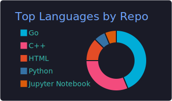

<h3 align="center">Hi there, I'm developer and focus on Go&Rust&Solidity 🌲  </h3>

🔫 Here are some fun facts about me:

- 🔭 I’m currently working on blockchain backend.
- 🌱 I’m currently learning Rust&Solidity.

**Nice to meet you and best wishes for you, my friends :)**

<h2></h2>

 

 

<!--
**liangjisheng/liangjisheng** is a ✨ _special_ ✨ repository because its `README.md` (this file) appears on your GitHub profile.

Here are some ideas to get you started:

- 🔭 I’m currently working on ...
- 🌱 I’m currently learning ...
- 👯 I’m looking to collaborate on ...
- 🤔 I’m looking for help with ...
- 💬 Ask me about ...
- 📫 How to reach me: ...
- 😄 Pronouns: ...
- ⚡ Fun fact: ...
-->